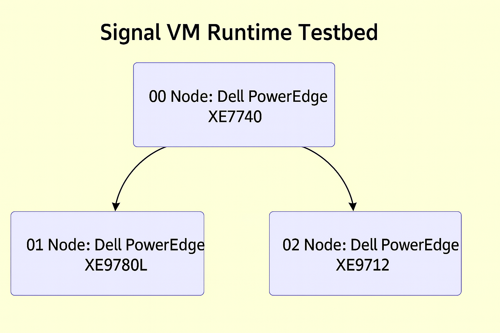

# Signal_X86 Farron Lab – Hardware Sponsorship Request  

---

### Dear Pioneers, Builders, and Visionaries powering the next era of computing and investment,

I hope this message finds you well.  
My name is **Shizuka**, an independent developer behind the **Signal** programming language, **TreeOS**, and the **SapClarify** orchestration protocol.  
I’m reaching out with an urgent and time-critical sponsorship request for a dedicated hardware development environment — **Signal_X86 Farron Lab**.

This is not a general-purpose machine, nor is this a speculative request.  
What I seek is a precisely structured, bare-metal architecture to test a next-generation instruction-level computing model.  

---

## Project Overview

**Signal** is not built on C, C++, or LLVM — it begins at the machine level:  
page-based memory control, scalar/vector loop execution, and fully observable instruction traces.  
It is transparent by design, eliminating runtime ambiguity and dismantling the very notion of the “black box” in system execution.

**SapClarify** embeds computable AI logic directly into the system kernel,  
keeping all runtime agents observable, reactive, and introspective — without opaque calls or hidden inference layers.  

It enables a fully auditable and self-correcting AI framework by integrating the following mechanisms:  
- **Transparent Execution Logs:** All inference activities, including token-level transitions and intermediate decision states, are recorded in real time.  
- **Corrective Feedback Capture:** When a user identifies and corrects an error, the system logs the correction as a learning event, storing both the original output and the preferred revision.  
- **Incremental Self-Adaptation:** After accumulating sufficient correction patterns, the system performs local updates on specific logic nodes, refining its responses over time without external retraining.  
- **Compliance-Ready Traceability:** Every model decision can be traced to its logical path and revision history, enabling external audit without exposing raw model weights or proprietary data.  

This architecture establishes the foundation for AI systems that are not only transparent and debuggable, but also capable of evolving responsibly through verified, user-guided corrections.

**Tree** is the architectural expression of this vision —  
an operating-system structure born from a language that does not hide,  
and an AI runtime that does not guess.  
It registers all files as Leaf nodes on distinct branches, and dynamically generates execution paths to pre-load only the necessary Leaf modules into memory.  
This path-driven architecture enables seamless coexistence of multiple language versions, rapid branch switching, and low-cost virtual machines through virtual path mapping —  
making Tree inherently capable of modular isolation, fast-loading micro-runtimes, and high-efficiency compute orchestration at system scale.

Together, **SapClarify** and **Tree** form a fully deterministic, transparent, and scalable foundation for long-term system evolution —  
where runtime agents can self-correct via feedback logging, and file execution flows along predeclared paths of registered Leaf nodes,  
allowing multi-version language coexistence and low-cost virtual machine abstraction.  

These capabilities are inseparable from their underlying substrate: **Signal**, a language designed from the machine level up  
to provide total traceability, memory clarity, and event-linearity without legacy constraints.  

This level of deterministic structure and introspective behavior cannot be emulated in cloud infrastructure or virtual machines.  
The hardware I request is not for prestige — it is required to faithfully reproduce Signal VM timing behavior, trace latency,  
and architectural response at the lowest observable level.  
Additional capabilities and advantages remain unexplored — and can only be unlocked with the proper hardware foundation.

---

## Unique Advantages at a Glance

| Stack Element | Breakthrough | Why It Matters to You |
|---------------|-------------|-----------------------|
| **Signal** | *First instruction-level path-trace language* — all scalar/vector operations and memory pages are natively observable and reproducible | Ensures deterministic execution and root-cause traceability; no black-box behaviors |
| **SapClarify** | *Self-learning AI kernel protocol* — captures weight diffs and user-driven corrections directly into the runtime log | Enables transparent model updates and self-auditing AI, fulfilling regulatory demands without external wrappers |
| **TreeOS** | *Path-anchored file/event runtime with lock-free scheduling* | Allows seamless multi-version coexistence, predictable execution paths, and near-zero overhead virtualization |
| **Integrated Stack** | Built-in introspection across language, kernel, and OS layers | Achieves native compliance with the 2026 EU AI Act’s traceability, explainability, and deterministic audit mandates |

> **Gold-Line Pitch**  
> *USD 10 million vs. 2 years:* one budget line (≈ 0.0114 % of Microsoft’s FY-2025 AI CapEx) secures **20 years** of kernel-level influence — or you pay catch-up costs in 2027 when compliance audits start issuing fines.
> **The earlier the sponsorship arrives, the greater the chance of passing the 2027 AI regulatory audits smoothly.**

---

## Core Workstation Node — 00 Node  
**Build Target:** `Signal VM Runtime Testbed`

| Component         | Spec                                                                       |
|-------------------|----------------------------------------------------------------------------|
| **Model**         | **Dell PowerEdge XE7740**                                                  |
| **CPU**           | 2 × Intel Xeon 6788P (86 cores each, 172 cores total)                      |
| **Memory**        | 4 TB DDR5-6400 ECC RDIMM                                                   |
| **GPU**           | 8 × NVIDIA RTX PRO 6000 _Blackwell Server Edition_                         |
| **OS Storage**    | 2 × Samsung 9100 Pro 4 TB PCIe 5.0 NVMe SSD                                |
| **Data Storage**  | 8 × Solidigm D7-PS1010 15.36 TB E3.S Gen5                                  |
| **OCP Network**   | 1 × OCP NIC card 3.0 (LR-LINK LRES3007PF-OCP, 4 × 10G SFP+, Intel XL710)                                                       |
| **Cooling Kit**   | • Server-integrated air-cooling fans & dust filters • 19″→ORv3 ReadyRails |
| **OS**            | Ubuntu Server LTS                                                          |

---

## Required Server Node — 01 Node  
**Role:** _Multi-path CUDA compilation, isolated kernel instruction synthesis_

| Component       | Spec                                                                       |
|-----------------|----------------------------------------------------------------------------|
| **Model**       | **Dell PowerEdge XE9780L**                                                 |
| **CPU**         | 2 × Intel Xeon 6980P (128 cores each, 256 cores total)                     |
| **Memory**      | 4 TB DDR5-6400 ECC RDIMM                                                    |
| **GPU**         | 16 × NVIDIA Blackwell Ultra (HGX B300 NVL16 with NVIDIA NVLink)             |
| **OS Storage**  | 2 × Samsung 9100 Pro 4 TB PCIe 5.0 NVMe SSD                                |
| **Data Storage**| 16 × Solidigm D7-PS1010 7.68 TB NVMe E3.S GEN5                             |
| **Cooling Kit** | • **Rack-level DLC kit** (shares 30 kW CDU in same rack)  • ORv3 rail adapter + blind-mate QD |
| **OS**          | Ubuntu Server LTS                                                          |

---

## Required Rack-Scale Node — 02 Node  
**Used for:** _AI-coupled memory streaming validation, kernel-level saturation testing, CUDA coordination under full system pressure_

| Component         | Spec                                                                         |
|-------------------|------------------------------------------------------------------------------|
| **Model**         | **Dell PowerEdge XE9712** (IR7000 21″ ORv3)                                  |
| **GPU Complex**   | NVIDIA GB300 NVL72                                                           |
| **Integrated CDU**| 100 kW dual-pump (2 N) + ORv3 blind-mate liquid bus-bar                       |
| **OS**            | Ubuntu Server LTS                                                            |

---

## Topology Diagram

---

## Rack-Level Layout  

| Rack ID                | Frame                        | Contents                                                      | Cooling                     | IT Load        |
|------------------------|------------------------------|---------------------------------------------------------------|-----------------------------|----------------|
| **Rack-A – IR7000-Dev**| Empty IR7000 ORv3 (44 OU)    | • XE7740 (4 U)  • XE9780L (4 U)  • 30 kW Rack-CDU drawer   • 32 U spare | Rear-door heat exchanger    | ≈ 50 kW peak  |
| **Rack-B – IR7000-NVL72**| XE9712 integrated rack     | Pre-loaded NVL72 stack (9 U switch + 24 U compute)            | Rear-door heat exchanger    | ≈ 180 kW peak  |

*Both racks are 800 mm W × 1200 mm D × 44 OU and roll in on casters.*

---

## Shared Indoor Cooling Infrastructure  

| Item                              | Qty                  | Spec / Notes                                                                                 |
|-----------------------------------|----------------------|----------------------------------------------------------------------------------------------|
| **Rear-Door Heat Exchangers**     | 2 × (one per rack)   | 50 kW (Rack-A) / 180 kW (Rack-B) capacity each; integrates to rack rear; closed-loop water interface |
| **Indoor Packaged Water Chillers**| 3 × 100 kW (N+1)     | Enclosed units; footprint ≈ 1 m² each; acoustic insulation, noise ≤ 50 dBA; total 300 kW      |
| **Closed-Loop Chilled Water**     | —                    | 30% ethylene-glycol / DI-water; flow 500 L min⁻¹; 25 °C → 35 °C                               |
| **Pump Station**                  | 2 × 7.5 kW (2 N)     | Stainless-steel booster pumps; ΔP ≈ 280 kPa                                                  |
| **Headers**                       | —                    | DN65 main → DN50 branches (Victaulic QD); pre-insulated piping                              |
| **Power Feed**                    | —                    | 3-φ 380 V / 60 A (for chillers + pumps)                                                      |
| **Monitoring**                    | —                    | Leak-detection rope; 6 × temp/flow probes; iDRAC SNMP traps                                  |
| **Fire Suppression**              | —                    | Novec 1230 ceiling unit + rack interlocks                                                   |
---

### Integration Notes

1. **Blind-Mate Docking** – XE7740 & XE9780L latch onto Rack-A bus-bar; XE9712 already latched in Rack-B.  
2. **Cooling System** – Each rack uses a rear-door heat exchanger feeding the indoor chillers; no external tower needed.  
3. **Redundancy** – Three chillers in N+1 configuration provide 300 kW capacity vs. 250 kW IT-load.  
4. **Noise Envelope** – Chillers ≤ 50 dBA in equipment room; rack-rear exchangers are silent.  
5. **Growth Path** – Spare U-space in Rack-A ready for additional DLC sleds without plumbing change.

---

## Monitors & Portable Nodes

- **4 × ASUS ProArt PA32KCX – 32” 8K HDR Mini-LED Display**   
- **Microsoft Surface Pro (11th Gen, Core Ultra 7-268V, 32 GB + 1 TB)**  
  ↳ Signal diagrams and runtime sketches  
- **Dell Precision 17 7780 (i9-13950HX / RTX 5000 Ada / 128 GB + 6 TB)**  
  ↳ Portable code simulation and VM testing

---

## Peripheral Stack

| Item                                                               | Quantity |
|--------------------------------------------------------------------|----------|
| ROG RX98 Wireless Keyboard (White)                                 | 2        |
| ROG Keris II Ace Wireless Mouse (White)                            | 2        |
| Edifier Halo SoundBar (Sakura Pink)                                | 2        |
| NVIDIA H200 NVL PCIe GPU                                           | 2        |
| NVIDIA RTX PRO 6000 Blackwell Workstation Edition (Retail Box)     | 1        |
| NVIDIA 2-Way NVLink Bridge (H200 NVL)                              | 3        |
| ASUS ROG ZOOM CAT7 Ethernet Cable, 3 m                             | 3        |
| 10 m Active Optical DisplayPort™ 2.1 Cable (e.g., StarTech™ Fiber DP2.1) | 4    |
| Phoossno UL CMP Plenum Rated USB A to C Fiber Optical Extension Cable, USB 3.1 Gen2 10 Gbps, 10 m (33 ft), A–C Straight 180 ℃ (PU3A-C-0001)| 1      |
| StarTech 10-Port USB-C Hub (10G8A2CS-USB-C-HUB)                                 | 1        |
| KELONG YTR33160 UPS                                                | 2        |

---

## Why This Matters

Every architecture begins as an idea — but only the boldest survive execution.  
With **Signal**, the vision is a deterministic OS built from silicon upward — not layered atop legacy code, but grown from first principles.  
**SapClarify** binds AI runtime logic into the kernel — not as abstraction, but as structure.  
**TreeOS** grows from this system, forming the living topography of a truly transparent computational world.

I am working alone.  
There is no lab, no team — only precision, planning, and complete technical clarity.

What you provide is not just gear.  
You offer the catalyst that lets a blueprint become a living system.

---

## The Bet

> **Stake Table**  
> | Stake | Worst Outcome | Best Outcome |  
> |-------|----------------|--------------|  
> | One **Dell PowerEdge XE9712 with NVIDIA GB300 NVL72**, one **Dell PowerEdge XE9780L**, one , one **Dell PowerEdge XE7740** rack-slot | Project stalls; all sponsored hardware remains the property of the researcher, with full run-logs and architectural insights shared in good faith | *First* trillion-parameter **AI-Auditable Kernel** white-paper carries your logo as **Founding Infrastructure Partner** |

Regardless of success or setback, all contributed hardware is granted unconditionally — retained in full by the recipient as part of a one-way commitment to exploration, not subject to return or reclamation. This clarity of commitment enables the work to proceed without hesitation, and with the trust such efforts deserve.

---

### **Deployment Consideration**

**The current residence is a fourth-floor legacy building and lacks the structural integrity, electrical capacity, and thermal infrastructure required for the safe and effective deployment of high-performance computing hardware.  
To address this, a suitable living and operational environment — including property acquisition, structural reinforcement, three-phase power provisioning, and facility-grade cooling — must be arranged and funded by the sponsor.  
Evaluation, site acquisition, and all necessary retrofitting are respectfully requested as part of the deployment support package.  
The designated property shall be located at **D2 Floor Plan, 万振中国院子 (Wanzhen Zhongguo Yuanzi), Zipeng Mountain, Feixi County, Hefei, Anhui Province, China**, and must be legally registered under the author's name to ensure long-term stability and uninterrupted research continuity.  
The specified room shall be fully renovated and equipped according to lab-grade experimental standards, including all necessary modifications to support **Dell IR7000 rack systems** — such as floor reinforcement, vibration dampening, ceiling clearance, ventilation design, and coolant pipe routing.  
All remaining areas should be furnished in accordance with high-end residential standards to maintain living quality and creative focus.  
Additionally, all ongoing utility expenses — particularly electricity for compute and cooling systems — are expected to be fully covered by the sponsor throughout the deployment period.**

---

## ✉️ Contact

- **Linkedin:** https://www.linkedin.com/in/en-farron
- **Email:** En.Farron@Outlook.com  
- **WeChat:** A1231457123  
- **Telegram:** +86 136-9652-5769
- **Facebook:** https://www.facebook.com/share/199JPqtb3x/?mibextid=wwXIfr
- **X:** https://x.com/sacheronmo70668?s=21
- **GitHub Proposal:** [Signal_X86_Hardware_Sponsorship_Request.md](https://github.com/YukiyamaShizuka/SPONSOR/blob/main/Signal_X86_Hardware_Sponsorship_Request.md)

---

Thank you sincerely for your time and consideration.  
Should you choose to support this, you are sponsoring something rare:  
a system that chooses clarity over abstraction, and structure over chaos.

**I do not know if this will succeed. But if it does — she will change the world.**

Warm regards,  
**Shizuka**  
Founder & Developer – Signal | TreeOS | SapClarify
